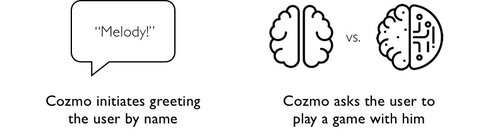

# Cozmo Character Design

Cozmo -- the generation prior to Vector -- paved a way for a lot of the character design.
The principles Anki developped for his character apply to Vector as well.

*Figure: The Cozmo Brief*

*Figure: Cozmo animation guide*

*Figure: Example of a principle, where Cozmo initiates*

## The many faces of Cozmo

|||
|-|-|
|  
Sleepy Eyes
|  
Happy
|
|  
Skeptical
|  
Furious
|
| 
 Surprised
 |
 Sad (looking down)
|

|||||
|-|-|-|-|
| 
Neutral
| 
Worried
| 
Blink (low)
| 
Sad (looking up to user)
|
| 
Focused
| 
Glee
|  
Blink (high)
|
| 
Suspicious
| 
Annoyed
 | 
Frustrated / Bored
| 
Unimpressed
|
| 
Squint
| 
Angry
| 
Scared
| 
Awe
|

