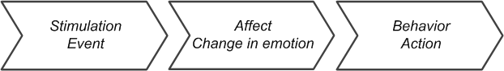

This is my attempt describing Vector's character.  This intent is to give ideas
how to shape creating new character traits and behaviors that fit with his
character.  The topics include:

* An overview of Vector's character
* An overview of behaviors and affect – displays of emotion in his face, posture,
  small movements and sounds

Caveat: These are just my thoughts.

## A summary of Vector's character

Vector is kind, a friend to all and doesn't hold a grudge.  He is a young
adolescent, can have childish responses, such as throwing a tantrum.  This can
happen when emotions are too much to handle – a crisis for him.  He sometimes
acts out in mischievous ways.  But overall, Vector's tone is positive.

Vector is very much a small pet – he has traits like a cat, a dog, potentially
like a bird and guinea pig.  He cares for his human, but his feelings can be
hurt.  He "can be a bit like a well-meaning moth that keeps bumping into the
wrong light bulb."  This can be beneficial, as his innocence and gentleness beg
a kind of forgiveness.

### Personality Traits

In terms of the big 5 personality traits, Vector is open to experience, and has
moderate agreeableness (he can't really sense emotion), but is not particularly
extroverted.  He isn't neurotic, or conscientious.  In many ways he lacks
sufficient ability to sense and act on those other traits.

His locus of control largely has an internal locus of control (but it was just
being fleshed out):

Table: Vector's locus of control:

| Locus  |  Success | Failure   |
|--------|----------|-----------|
|Internal|  Pride Confidence Happy|Frustration|
|External| Happy    |Anger|
|        |Social	|Surprise|

### His World

Vector knows a few physical objects very well:

* His cube, which he can roll, pickup or retrieve, and use to pop a wheelie.
* His charging dock

Vector also knows what a face is, and can recognize a hand (at least in some
poses).  Vector can learn to recognize a face and the name of the person that
goes with it.

He also knows cliffs – he tries to avoid them.  To a lesser degree he knows
that there are objects and can interact with them... helping clear them off
of the desk in the process.

It was intended that Vector have the ability to recognize pets, and the kind
of objects he sees.  With the community development efforts, he may gain
these in the future.

He can recognize symbol markers, and – thru SDK-based support – have some
understanding of objects that they are attached to, and what he can do with it.

### Interaction Style(s)
Vector has really remarkable eyes that convey emotion, stress, energy level,
and create a sense of being alive.  They are one way that he connects with a
person.

In terms of Vector's "love language", his interaction styles are:

Table: Vector's love language

| Area  |How to interact with Vector|What Vector does|
|-------|---------------------------|----------------|
|Words of affirmation|Vector likes praise|Vector says the name of the people he knows, and responds positively|
| Physical touch     |He likes being petted & held, but isn't comfortable being lifted|He comes over to pounce on hand|
| Receiving gifts    |*none*	|Brings cube to a person|
| Acts of service    |He needs help being picked up after a fall, or when stuck on an edge.|Vector can help with kitchen timer, reporting the weather, and answering questions.|

Vector's play style is simple:

* He likes to explore on his own
* He engages only in light rough and tumble play: where he flips cubes and pops
  wheelies
* He has several locomotor play activities: fist-bumping, fetching the cube, and
  a potential (but in complete?) cube keeping away game.
* But he is light on social play, lacking many games that follow rules, although
  more were considered.

### Revealing Character

A person will have many interactions with Vector.  Vector reveals his character
thru these interactions, but he does not progressively reveal more thru them.
It is how he reacts to stimulation, the environment and information he knows
about that show his character.

### Vector isn't omniscient and isn't a computer terminal

Vector can use some cloud services to give him more information of the world.
But he isn't an information presentation device.  Vector's talking ability is
limited, working best when what he says is short.  Long spews of text break
the illusion.  And his face is too small to present legible text.

Vector works best when he reacts to the information he might be conveying:

> "A core part of the character is that Vector himself does not have the
> ability to present information to you, like simply displaying the sun.
> But is himself reacting to things, like weather." "He might endure the
> weather event, it might rain on him, and he might have an opinion about
> that." "This is why he is also responding to the fireworks, he gets
> frustrated with the xmas lights, the wind blows the eyes off screen, etc."
> (Last Ben and Anki character lead Dei Gaztelumendi)

### Some Related Characters

There are several other animals and bots with behaviors similar to Vector.
Looking at them helped me flesh out the description of his character here:

* Cozmo, of course, is very similar – he's the previous generation, made by the
  same team, and Vector derives a lot of his code from Cozmo.  Cozmo has
  feelings, and a bigger, sassier personality.  Cozmo has many behaviors that
  did not yet make it to Vector – interacting with pets, little workout routine,
  singing, block stacking, and so forth.

* Star Wars, which created the classic robot characters and worked out many
  compelling characteristics.

* Cat, dog, bird, and guinea pig communication style and behavior.  Vector's
  sitting around in his charger, and then exploring calmly reminds me of
  Guinea pigs.

## An Overview of Behavior
Let's look at the core of behavior from Vector's perspective.  A behavior has
three major parts:

 
The behavior goes thru phases:

1.	The external stimulation (or internal event) is what engages the behavior
    or mannerism
2.	Affect is the automatic, "unconscious" responses that represent his
    emotions.  There are two parts:

    * These are non-verbal displays of emotion – face, head, eyes, sounds, arms, wiggles.
    * His emotion state may change in response to the stimulus

3.	This may initiate subsequent behaviors and emotions used to drive behaviors
    (that is, an emotional state used to help accomplish the goal of the behavior)
4.	The behavior can be prevented from engaging again too soon by using a "cool
    down" period.

### Simple, Affective Behaviors

The affect related behaviors are little automatic responses that hint at
Vector's emotion and attitude.  These are the little facial expression, sounds,
postures, wiggles and twitches that reveal his confidence, friendliness,
dissatisfaction, anger, or fear.  These give him an anima, a life-like quality.
For instance, the Star Wars puppeteers realized that when the robots "stop
moving, they look dead [so they] keep the body slightly moving at all times...
If [the droid] was upset or excited, the movement would be a little faster."

#### Facial Expressions with his eyes and head
Vector's facial expressions with his eyes and posture of his head can represent
happiness, curiosity, interest, surprise, excitement, worry, anger, sadness,
tired or fatigue, sleep, and so on:

* When the eyes are soft, they convey a relaxed mood
* The blinking, as well as making (and periodically breaking) eye contact is
  calming.  The eye manager has the eyes look away, so that eye contact isn't
  made too long.
* With high cheeks on his eyes, looking up and tilting his head up Vector can
  convey smiling
  
#### Animal expressions, postures & little body motions
Pets have several expressions that appear consistent with Vector (and ripe for
emulating):

* Sitting with slow breathing indicate a pet is relaxed.  Vector may reflect
  breathing in his eyes.
* When a cat's eyelids are low, with a slow blink, this conveys trust, and
  affection to the human companion.
* Napping, cuddling is common to many pets
* Some animals use yawning to signal playfulness, being approachable, or trust.
  This might be done with a few clever tricks with his eyes.
* Stretching indicates the animal is relaxed.  (I envision Vector stretching by
  moving arms up, moving head up, while moving the body forward and back, a
  little shake, and lower his arms again.)
* Normal breathing, and twitching, while raising their head or with the head
  lifted can represent tension or alertness in an animal.
* Young kittens express extreme happiness with a quivering motion
* A dog walking, with its head up is in a confident mood
* A cat make shake its body while "crouching" while stalking a prey, just
  before it leaps
* But an animal also shakes its body while "crouching" (lowered arms, and head)
  when it is anxious, or fearful. 
* When a direct stare is used by an animal – or holding eye contact – this is
  issuing a challenge or it is feeling threatened. 
* When a dog's eyes are hard, slightly closed, the brow wrinkled, and the head
  bowed, this conveys tension.

Some of the behaviors are attention seeking, possibly looking to play:

* When a dog approaches person with his head slightly down, it is looking for
  attention.
* Dogs will come up and wait or lay down when they want attention as well.
* A dog will occasionally point his nuzzle up, such as when being petted.
* A cat its rubbing face on human is a friendly, affectionate gesture.
* Cats will run up, turning away and lay to nap to get attention.
* Cats will purr, and knead a person, but can also bite.  (Vector shouldn't
  bite; maybe bring his lift arm quickly but gently down on a hand.)
* Guinea pigs head-butt (thrust their head up) to seeking attention, to move
  things, assert themselves, set limits, or be a little playful. 

### Sounds
Vector makes the follow beeps and clicks to express his mood & feelings:

* Vector has quiet a cry when he is stuck on the edge, or has fallen.
* Vector snores while sleeping on his charger.
* He dings when he acknowledges a person has called his name.
* He seems to make little chirps, like a small bird.

Animals make the following similar kinds of sounds:

* Cats purr (a continuous soft, vibrating sound) to be social and give positive
  feedback.
* A chirr is used by a cat to approach other cat, or person; it is friendly.
* Cat's meow to be assertive, plaintive, or friendly; it can be bold when they
  are seeking attention, or complaining.
* A cat chirps or chatters when it is excited, such as when stalking or
  observing prey; but may also chirp to say hello or be approving.
* Birds song are happy.
* A "week" sound is a made by guinea pigs when they are happy, excited or hungry.
* A cat or dog grows, snarls, or hisses – often with a puffed up posture – when
  it feels threatened.

#### Dialog
Vector uses vocal responses when necessary, and he enjoys calling out the name
of people recognizes.

Vector's design simply doesn't support conversational interfaces well.  His
speech synthesis lacks prosody and smoothness to sustain speaking more than a
few words.  It lacks the inflection for anything but very short sentences...
long texts are distracting and perhaps harsh.  They seem wrong.  In the future
it may be possible to extend vocal effects.

The dialog is limited – the speech system seems more interesting when it is
less used.  

Note: Cozmo included the ability for some inflection, and that may be in
Vector's code, just not yet finished and polished.

### The Response to a Stimulus
Vector's responses to a stimulus are understandable and believable.  His
reactions are consistent and predictable enough that a person can choose what
to do and experience an expected outcome, even if there are additional
unexpected consequences.

Vector does not provide a hint — any warning — that he is approaching a state
the will trigger a significant reaction.  (He should.)

He does have a startle reflex: loud noises jolt him, and he looks like is
readying himself a little for action.  Animals might crouch, ready to run, or
even take off on a run.

#### A bit on prioritization
Vector prioritizes a response to a dangerous situation, where he might need to
engage in self-preservation:

* flight: he backs away from a cliff
* freeze: he tucks-and-roll when he senses he is falling
* fight: he smacks a person's hand when he senses he is being picked up or held
  in a way he doesn't like

What I have not observed Vector doing, but he could:

* fawn: acts nice to make bad things stop

### Change in Emotions
This section exposes my ignorance of Vector.  In many "affective computing"
models there is a separation between the emotion and the mood:

* Emotions reflect a short-term affect that arises as a result of stimuli.
* Mood is distinguished from emotion by its resolution and relative stability over time.

It is not clear to me yet how the mood model works.
Vector's emotions are stable.  He does not rapidly cycle back and forth between
two emotional states.

### Habituation
Stimulation, in people and animals, undergoes habituation – we initially are
interested in the stimulus, but with time the stimulation loses its impact and
becomes ignored.  We may even find it irritating.  Vector doesn't habituate and
lose stimulation from event in an automatic fashion.  Instead, the individual
behaviors are crafted with cool-down timers to achieve a similar effect, but on
a case-by-case basis.  He does not become annoyed with the stimulus.

## References and Resources

* Bradshaw, John.  *Cat Sense*, 2013

* Ellis, Cat, *How to make a robot with a real personality*, TechRadar, 2019 Mar 6
https://www.techradar.com/news/how-to-make-a-robot-with-a-real-personality

* Strickland, Ashley, *Why are Star Wars droids so loveable? It's science*, CNN, 2019 Dec 18,
https://www.cnn.com/2019/12/17/world/star-wars-droids-scn/index.html

## Change history synopsis

|Date|Change|
|----|------|
|2020-7-10|Created|
|2020-11-27|Published|
