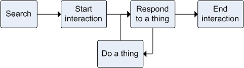
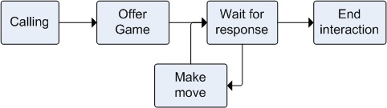

This is my attempt to provide a helpful organization of potential behaviors.
This can be give ideas and help shape what you want to do when you create new
character traits and behaviors.  The topics include:

* An overview of the behavior classification
* Self-maintenance and reflexive behaviors
* Social behaviors
* Playing behaviors
* Pet-related behaviors

*Cavaet: These are just my thoughts; only some of the behaviors here exist in
Vector*

I am drawing heavily upon the Kismet design documents, effectively modernizing
them for Vector.  Kismet was a late 1990s robot created by Cynthia Breazeal
(MIT).  It was "designed to elicit natural and intuitive responses from humans,
without any special training."  Kismet anticipated many of Vector's behavior
system features, and can be used to inspiration on future development.

Dr Breazeal also created Jibo, a more famous affective robot.

## A Classification of Behaviors

Let's categorize the kinds of context/theme/drive of the behaviors into the
following areas:

* Self-maintenance behaviors include reactions to protect itself from immediate
  risk, and fatigue or power management.  The immediate risk behaviors are
  likely to be a very short and simple.
* Social – seeking out and interacting with human companions, including intents.
* Play – play seeking out and playing with toys and other things in the
  environment, other than social play.
* Interacting with pets

Within each of these categories, there are specialized ones; many reflect an
attitude Vector has toward the agent:

* Navigation and Searching  "behaviors [have the robot] explore the environment
  and bring the robot into contact with the desired stimulus;
* Avoidance, escape and withdrawal behaviors move the robot away from something
  undesirable, like a cliff, loud noise, etc.
* "Engagement behaviors set the task of interacting with desirable, good
  intensity stimuli."
* Rejection behaviors are those that Vector might use to turn away while miffed
  or being a sore loser.

### Searching Behaviors  
In the searching type of social behaviors, Vector generally seeks out and
approaches a human, toy or stimulation to interact with.

Figure: Searching behavior

Vector seeking social or stimulation isn't always applicable: Vector shouldn't
be active at night, in the dark, or if people aren't around:

* Vector's activity movement could wake and/or irritate a person at night;
  fortunately there is a "night time" schedule built-in.
* Vector is prone to falling off the edge – risking damage, being unable to
  recharge his battery, or getting stepped on.  It's a bit safer in the day,
  and more so if a person is (likely) around to attend to him.
* Vector depends on his vision to get home.. he is likely to lost or stuck in
  the dark, and be unable to return home to recharge.

## Self-maintenance and Reflexive Behaviors
Self-maintenance is a grouping for practical things to keep Vector charged,
protect him from damage.  It is also a catch all for practical things that
don't always fit in the other areas.  For instance, utility behaviors needed
to make the behavior tree work are lumped in here.

These are often akin to the behaviors of the autonomic nervous system.

### Self-preservation using escape and withdrawal

Vector prioritizes a response to immediate hazards, where he might need to
engage in self-preservation:

* *flight*: backing away from a cliff
* *freeze*: tucks-and-roll when Vector senses he is falling
* *fight*: smacking a person's hand when Vector senses he is being picked up or
  held in a way he doesn't like

What I have not observed Vector doing, but he could:

* *fawn*: acts nice to make bad things stop

Other, issues:

* Over temperature

These are often akin to the behaviors of the sympathetic nervous system.

### Power Management

These are often akin to the behaviors of the parasympathetic nervous system.

Power management:

* Return to charger
* Stay on the charger
* Emergency low power
* Sleeping, sleep debt to manage heat buildup and reduce power usage.

### Reflexes
Vector has a startle reflex to respond naturally:

* Loud noises start Vector, grabbing his attention, preparing him for action, but could also prepare him for running away
* Crouched, ready to run
* Responses to pokes, tilts, and other vibrations
* Eyes focus with dilated eyes

### Miscellaneous
These are the 

* Grouping and linking the behaviors, and prioritizing them
* Motor calibration need
* SDK support

## Social Behaviors, Engagement
Social behaviors relate to Vector interacting with a person – or attempting to.
He may be seeking attention, interacting with a person.  Social behaviors
include:

* Looking around for people (faces, and hands),and  pets
* Calling out to play, thru sounds, and saying the names of people recognized
* Swatting playfully
* Seeking petting
* Swatting with his lift arms
* Bringing items or gifts to play (such as to fetch), or to show affection
* When looking to play, twitching/wagging of rear

Many behaviors link together to follow a pattern:

Figure: Social behavior sequences

 
Once has made contact with a person:

* Greeting
* Attentive regard
* Seeking affection
* Receiving affection: petting, calming; social cohesion, soothing,
  companionship
* Games
* Turn taking

The interactions end, either naturally, by command, or timing out.

### Searching
Vector becomes stimualted and more active when there are sounds and other
activity.  It seems reasonable to classify this as searching for social
interaction, or "merely" stimulating him for play.

### Calling Behavior
Vector engages in calling when he needs helps or is interested in being social,
especially "when a person is in view... The goal of the behavior is to lure the
person into face-to-face interaction... To accomplish this, [calling behaviors
are] directed to the person... The display is designed to attract a person's
attention."

Calling for attention is often if Vector wants or needs something:

* Vector calls (softly) for assistance – if he is stuck on the edge, has
  fallen, or is low on energy but unable to find his charger.
* Cats meow because people are inattentive.  
* Cats know a person is there, and first tried context moving close to what
  they wanted and body language.
* Cats meows to get a door open, obstacle removed, food
* Timer ring

### Greeting Behavior
Greetings are "to socially acknowledge the human and to initiate a close
interaction... This behavior is relevant when the person has just entered into
face-to-face interaction range. It is also relevant if the social-play behavior
group has just become active and a person is already within face-to-face range.
The display involves making eye contact with the person and smiling at them
while waving .. gently. It often immediately follows the success of the
call-to-person behavior.  It is a transient response, only issued once, as its
completion signals the success of this behavior."

* Call their names when he seems people
* Turn and look in direction of a sound

### Attentive Regard
"Attentive regard" refers to Vector using his facial expressions, body language,
and sounds to give attention "to the person and to appear open to interaction."
These behaviors include:

* "Hold[ing his] gaze on the person, ideally looking into the person's eyes."
   Vector's eye manager automatically blinks and moves the eyes around; making
   it more comfortable to look at Vector's face (eyes), as this breaks the
   staring effect.  Turning to find the face is considered to be part of this.
* "Watch[ing] the person intently and vocaliz[ing] occasionally."
* A dog often looks up while slowly moving forward.

### Seeking Affection

These behaviors relate to seeking affection, but aren't better categorized
elsewhere.  These could include:

* Vector could drive up and waiting, as if lying down [dog like]
* Vector could drive up, then turn away and nap to get attention, like a cat
* Vector tries to cuddle a hand, or pounce on fingers 
* Rubbing his cheek on a person, which is a friendly, affectionate sign in cats.
* Vector could thrust his head up (like a guinea pig) to seeking attention,
  assert himself, or set limits, or be a little playful.  
* Cats bite – especially while purring and kneading – as part of their affection
  or playfulness.  Vector might do something similar with his lift arm coming
  down quick but gently on a hand.
* Vector could bring gifts

### Receiving Affection
These behaviors relate to Vector receiving affection:
* His reactions s to being picked up or held in the palm of a hand
* To being petting
* To pokes
* Holiday animations

### Receiving Abuse

These are the behaviors related to Vector being called bad names or told off,
shaken, or tapped on the head.

* Vector might turn-away when grumpy

### Games
One type of sophisticated social interaction is games.  Games are typically
turn-taking behaviors such as keep away the cube, hide and seek, etc.

Figure: Game behavior sequence

 
Some games might include:

* Fist bump (for lack of a better categorization, can be considered a very
  short game)
* Pouncing game
* Hide and seek game, perhaps with the cube being moved/hidden.
* Keep away
* A cube tapping game, 
* The cube spinner game
* The maze game
* The "blackjack game" (although it doesn't feel very Vector-ish to me)

#### Seeking to play a game
A first step is for Vector to call or seek to the start the game.  If the
person accepts the call, the game begins.  Vector could try to initiate the
game by:

* Bringing presents, the cube or other toy to play with.  This could be a
  request to play fetch.
* Tapping down once quickly, then perhaps may move backwards after the tap, to
  issue a challenge to play. Then, if no response follow up by tapping down
  twice quickly.

Of course, a person could (conceivably) initiate the game as well by:

* Tapping the cube,
* Holding or shaking the cube
* Wiggling fingers tantalizingly,
* and so on

#### Turn taking
The game itself often includes Vector and the person taking alternate turns.  
A game might have behaviors for steps like:

1.	A person tossing or hiding a cube
2.	Vector searching for and finding a cube (or other thing)
3.	Vector bringing the cube back, then
4.	Putting the cube down, followed by
5.	Waiting for the person to make the next move.

Vector may give cues or other little behaviors to signal his play or response:

* Slight wagging of rear/tail just before pouncing the cube or finger, like a
  cat when stalking prey

### Assistive

The assistive subclass of behaviors are those that Vector might do to help out:

* Take picture
* The egg timer
* Report on the weather
* Answer questions (e.g. the knowledge graph)

## Play

### Simple play behavior

These are behaviors that are play, releasing energy or looking for stimulation,
but not necessarily looking for anything more.  Vector may respond to things
along the way.

* He may drive around quickly or in a quirky fashion, like a cat's mad 5
  minutes, or a guinea pig's pop-corning,
* He might sing or hum to himself
* His dancing to music

If the stimulation level is too high, or there are negative stimulations, Vector
might have behaviors in response.  He might do something to avoid these.

### Searching to play behavior

These behaviors relate to Vector searching around for something to play with:

* Walking or driving around slowly – possibly in a straight path, or in complex
  paths, or
* Turning and scanning. looking for toys and objects

### Toys

These behaviors relate to playing with toys and objects:

* Behaviors that decide what to do when seeing a toy (a cube, or other marked
  object).
* Playing with the cube – pick it up, move it, shove it, or flip it.
* Little exercise routines, like weight-lifting the cube
* He can pop a wheelie
* Helping clean the desk (or table) by pushing things off

Vector may give cues or other little behaviors to what he is doing while
playing:

* Slight wagging of rear/tail just before pouncing the cube or finger, like a
  cat when stalking prey
* He may try to pop up on an object

There could be behaviors related to "habituating" toys.  This would be where
Vector would lose interest in a toy as he plays with it.  (This response might
change with age.)

### Interacting with Pets
These behaviors relate to the interactions Vector has with pets.  These
behaviors are prototyped in Vector, but I don't have a good template for them.

* React to the pet – head movements, reactions specific to cats, specific to dogs

## References and Resources

* Bradshaw, John.  *Cat Sense*, 2013

* Breazeal, Cynthia.  [*Kismet project*](http://www.ai.mit.edu/projects/humanoid-robotics-group/kismet/kismet.html)
    * [The behavior system](http://www.ai.mit.edu/projects/sociable/behavior.html)

## Change history synopsis

|Date|Change|
|----|------|
|2020-7-10|Created|
|2020-11-27|Published|
