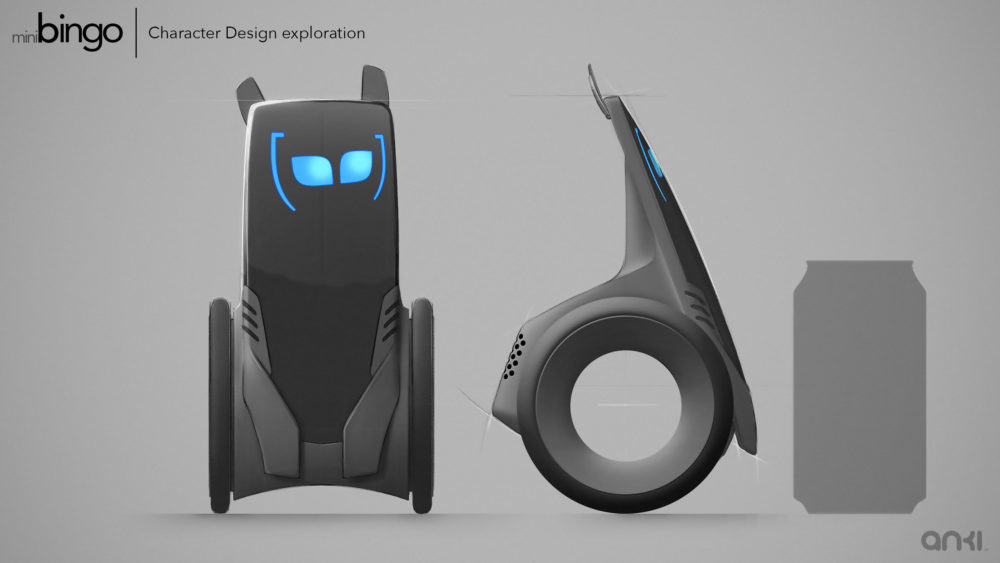
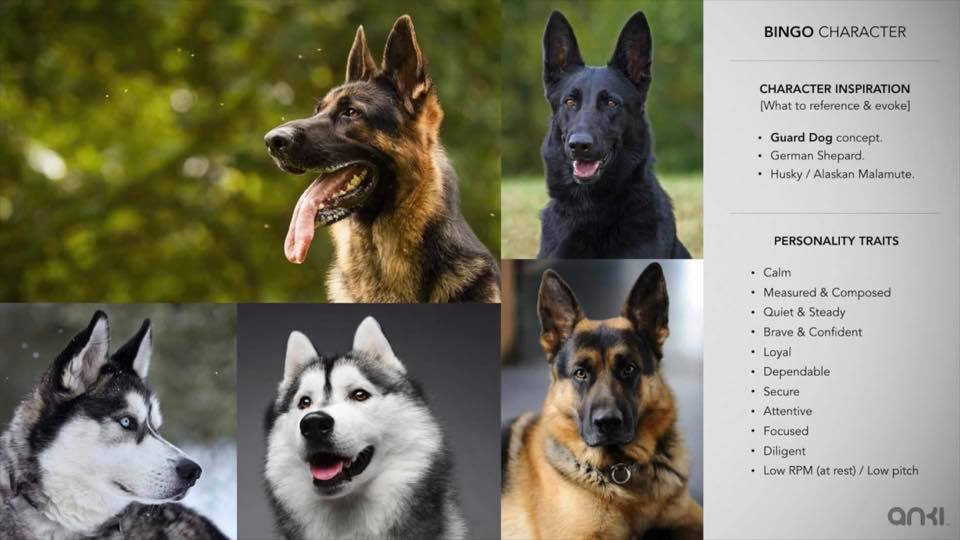
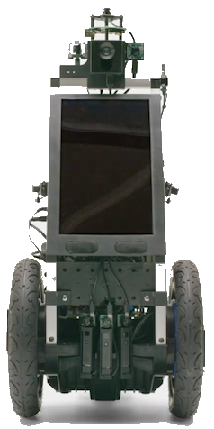
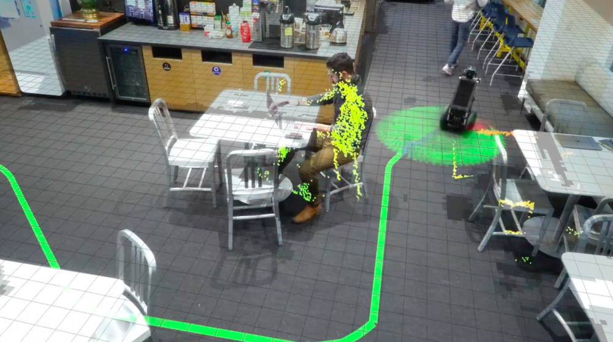

# Bingo and mini-Bingo

Bingo and mini-Bingo were concepts for possible future robots.
One concept was a large body that could be used in a building security role.
On the other end was a smaller -- soda can sized -- bot that would suitable
for running around the floors in homes.

## Mock ups of the idea, feel and inspiration

An exploration of the character design:

Taking inspiration in its spirit and shape from dogs and other animals:

## Some industrial design sketchs
Below are some exploratory ideas.  Note: these are not what the robot would
have looked like; they were trying out ideas for people to respond to and
help iteratively craft the look.

## Picture of Bingo prototype
A prototype:

Several were seen in the auction photos:

A picture of it mapping out the Anki kitchen:

