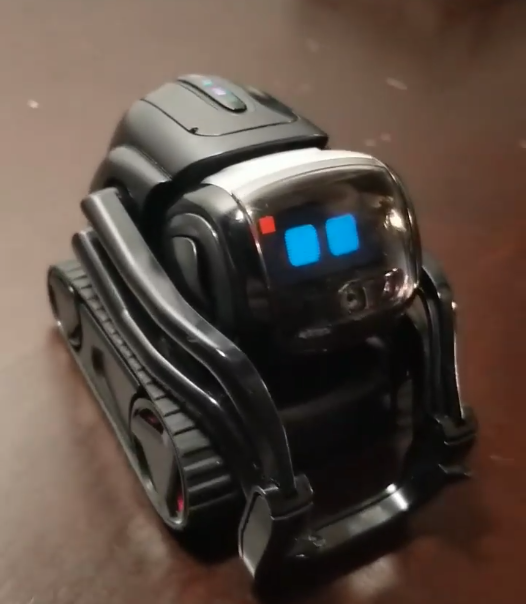

# Victor DVT1

"Victor DVT1" prototypes are the first of the Design Validation Test batches for Vector.

These are very similar to finished Vector in terms of hardware, but there are many software differences:

* Their partition tables are old, similar to what looks like stock Qualcomm.
* Many Victor DVT1s run builds which are more similar to Android than Embedded Linux.
* Many Victor DVT1s are in FAC (factory) mode. If you find one in FAC mode, he is very likely running old proof of concept software and there is a low chance of putting him on modern firmware.
* If you find one with Cozmo eyes, it is probably the same proof of concept firmware. Some have been upgraded to a slightly newer kernel though. Some can run behaviors when shaken.
* Their serial numbers are strings such as "1f19f8b7".
* Most have SSH open, but there is a root password. ADB over TCP is fully open but it may require a couple reboots.
* Their BLE software is old, and it is hard to connect them to your own Wi-Fi.

The "head board" hardware is pretty much exactly the same, but the "body board" hardware is very different compared to modern Vector hardware. This locks them to old DFU and they are not viable for normal Vector body replacements.

Bodyboard software upgrade is possible. TODO make a guide

There are some positives if you are a passionate developer. They have ADB open which means you can solder on USB and mess around all you want. Everything is completely open and unlocked so you could have a fun time. There is no recovery or system_b partition so be careful.

Their shells (+ motor boards, backpack board, laser) are fully compatible with regular Vector circutry.

The headboard can be upgraded to be like a normal Vector through USB. Check the Qualcomm Download Mode section.

They can use DVT2 ABOOTs, which allows for more modern and/or unsigned kernels. Their CPU fuses are not set.

Some of these connect to a network with the credentials below, which can be faked on your own router or hotspot so you can use ADB over TCP:

SSID: `AnkiTest2`
Password: `password`

These turn up from time to time on Ebay.

