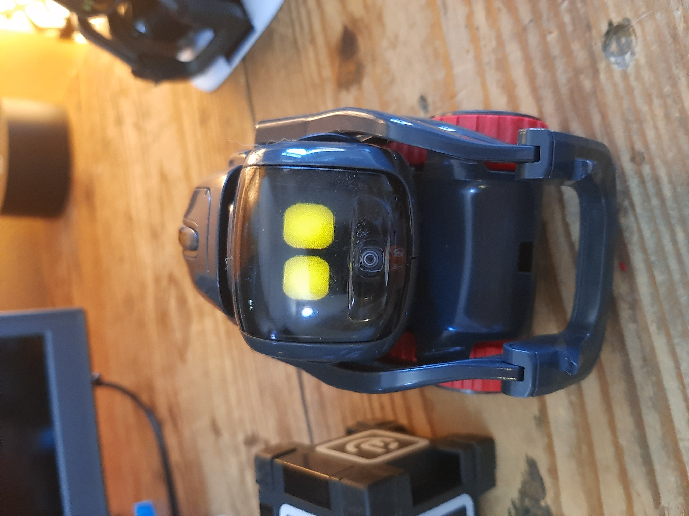

# Victor DVT3

"Victor DVT3" prototypes are the third of the Design Validation Test batches for Vector.

These look exactly like DVT2s, but there are a few differences here and there:

* Most of them are running firmware very similar to modern firmware.
* It is possible to connect many of them to Wi-Fi without faking a network.
* All we have seen so far have SSH open with the normal modern key.
* Their body boards are a little different.
* Many have been upgraded(?) to the modern partition table and have unlock OTAs so their headboards could act exactly like normal dev boards. A body board replacement would be required for it to fully work though as modern firmware doesn't know how to communicate with the body board in these.
* They started off with a random string serial number, but many have been upgraded to the more normal 00###### layout.
* Their head boards have heatsinks. This ended up not being necessary for production.

Similarities to Victor DVT1/2:

* Their serial numbers started off as strings such as "1f19f8b7".
* The "head board" hardware is pretty much exactly the same, but the "body board" hardware is very different compared to modern Vector hardware. This locks them to old DFU and they are not viable for normal Vector body replacements.

Their shells (+ motor boards, backpack board, laser) are fully compatible with regular Vector circutry.

DVT3 is when a lot of Vector personality development happened. Their firmwares can vary between 0.9 to 0.12 betas. These act similar to how Vector is today.

Some of these bots may boot up to an exclaimation point. Turning them upside-down then double (or triple) pressing the button will let them finish bootup. Then, you can shake them around to make them explore around.

These turn up from time to time on Ebay.

