# How to create a soundbank

Vector's audio engine does not directly use `mp3` or other common audio files.
Vector uses AudioKinetic's WWise sound engine.  This engine uses a proprietary
set of file `.bnk` and `.wem` files.  The result is a sophisticated mechanism
to create audible responses, little physiological effects, and more.

Unfortunately it is not intuitive to add sounds.  WWise is free for
non-commercial use; but this is not an easy tool to use.  That is why I've
written up this how-to.  It should make the process a lot more straight-forward.

I won't describe how to hook the new sounds into the animations or behavior
tree here.  That has its own multi-step process.

The sample WWise project that we create below can be downloaded [here](SoundbankStarter.zip)

## Preparation

### Tools You will need

You will need AudioKinetic WWise, version 2017.2.
This version is the one that creates file with the same version id that Vector
is expecting.  (Other version may work, but the internet reports version
mismatch is a very common cause of WWise errors.).

* Download and install AudioKinetic WWise by using teh [WWise Launcher](https://www.audiokinetic.com/download/)
    From there you will have to select this version.
* [WWise 2017.2 documentation](https://www.audiokinetic.com/library/2017.2.10_6745/?source=Help&id=welcome_to_wwise)

The free version of WWise has a cap of 200 audio files; it is unlikely you will
ever create that many in a single sound bank.  If you do, just break the sound
bank up to two or more.

### Your sound files

You will need to convert your sound files to `WAV` files ahead of time. That is
not described here.

## WWise to create the soundbank

This section we'll describe how to build a "media only" soundbank that can be
added to Vector.

### Starting a Project

Launch WWise, from either your application menu or the WWise launcher.
When WWise starts it will give you a window create a new project

*Figure: Starting WWise*

Click "New"

Note: Along the way WWise may present pop-ups to let you know that you don't a
have a license -- that this is only for non-commercial and evaluation use.
Click ok whenever that happens.

After clicking new, it give a pop-up to do a little initial paperwork to create
the project:

*Figure: Create a new project*

1. Fill in the name of the project with whatever you want.  Be unique
2. Add the linux platform: click the "Add" and then select Linux.
   (I don't know that this strictly neccessary)
3. Uncheck all of the other assets groups.
4. Click "ok"

### Creating a soundbank

The next step is to create our SoundBank.  Look for the project pane:

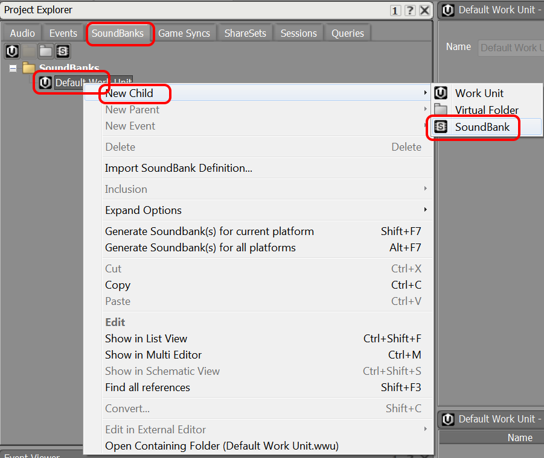
*Figure: Create a new soundbank*

1. Click on the "SoundBanks" tab
2. Right click on the "Default Work Unit" item under the "SoundBanks" tree
3. Go into the "New Child" submenu
4. Select "SoundBank"

This will create a panel to edit the sound bank.  If not, double click on
your new sound bank in the tree.  You should get a SoundBank Editor:

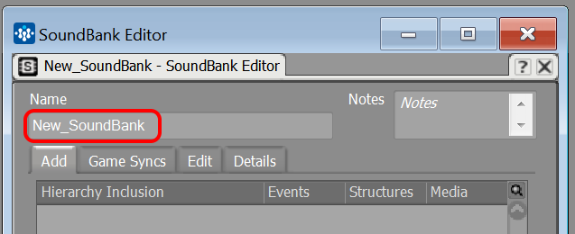
*Figure: Naming a new sound bank*

Give your sound bank a unique name.  This will be the name on the robot,
so make it descriptive, but unique.

### Importing Audio files

Next is importing the audio files.  You will need to convert your audio files
into the `WAV` format, if you have not done so already.

*Figure: Import audio files*

1. Open the Projects menu
2. Select "Import Audio files"

This will bring up a dialog:

*Figure: Add audio files*

1. Change the "Import Mode" to "Create new objects"
2. Change the "Import as" to "Sound SFX"
3. Click "Add Files" button
4. Select the files you wish through the usual dialog

Click "Import"

### Setting the file properties, ie, name, and conversion

Next, lets set the audio conversion.  Find the audio file in the project tree:

*Figure: The  audio files in the tree*

Click on the file.  It should open a panel on the right to configure the
properties of this file:

*Figure: The audio file properties*

1. Set the name of the file.  Optional, but this is a good time to change the
   name of the file to have a nice consistent, clean name.
2. Click the "Source Settings" tab
3. Under than click the chevrons next to the word "Default Conversion Settings"

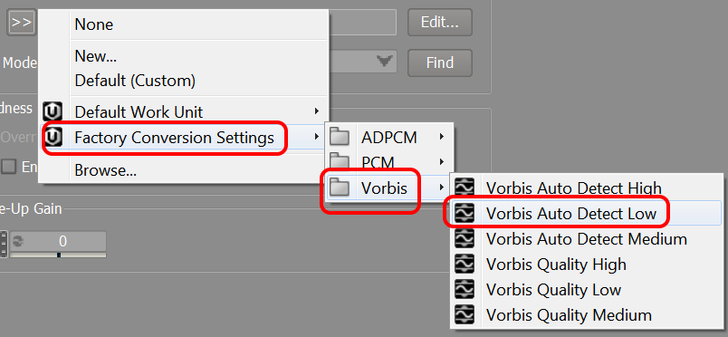
*Figure: The conversion settings*

Clicking on the chverons will bring up a menu

1. Click on "Factory Conversion Settngs"
2. Select "Vorbis"
3. Select one of the Vorbis formats.  Probably any will do.
   (Probably any ADPCM will do to, but I haven't confirmed it.  I don't have
    guidance for which to choose.)

Finally, we need tell it to create a separate WEM file.

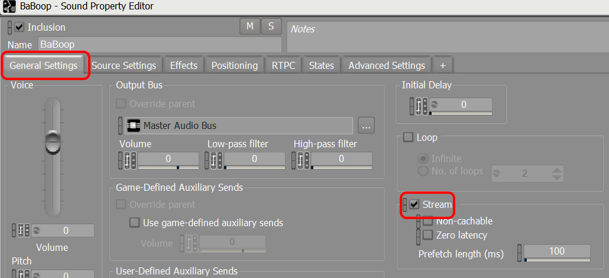
*Figure: The stream setting*

1. Click on the "General Settings" tab.
2. Check the "Stream" check box.

### Create an event and action to play it

Next we need tell the audio engine that this is playable.  To do that we need
to create a Event with a play action.  Click on the "Event" tab:

*Figure: Creating a play event*

1. Right click on the "Default Work Unit"  This will bring up a menu
2. Select "New Child"
3. Then click on "Play"

This will add an item to the tree on the left under "Default Work Unit",
in edit mode:

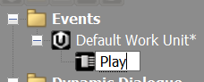
*Figure: New a play event*

Give the name something like "Play_*sound name*" 

On the right side a panel should appear with the properties for this event.
It doesn't know yet to play this particular sound.  We'll connect that now.

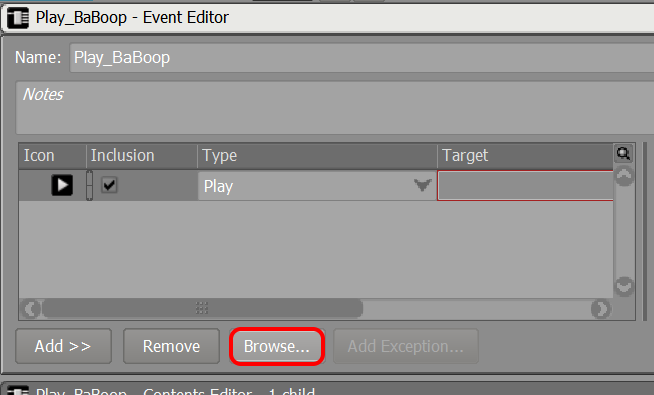
*Figure: Attach a sound to the play event*

Click on "Browse".  This will pop up a window to select which sound.

*Figure: Selecting a sound to attach to the play event*

We need to add it to the sound bank.  If the sound bank panel isn't open, click
on the SoundBanks tab, and double click on the sound bank.

Click on the Events tab and drag the new event into the soundbank:

*Figure: Adding the play event to the sound bank*

You should then see:

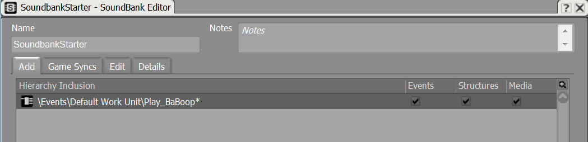
*Figure: The play event in the sound bank*

Click on the Audio tab, and drag the audio file into the soundbank as well:

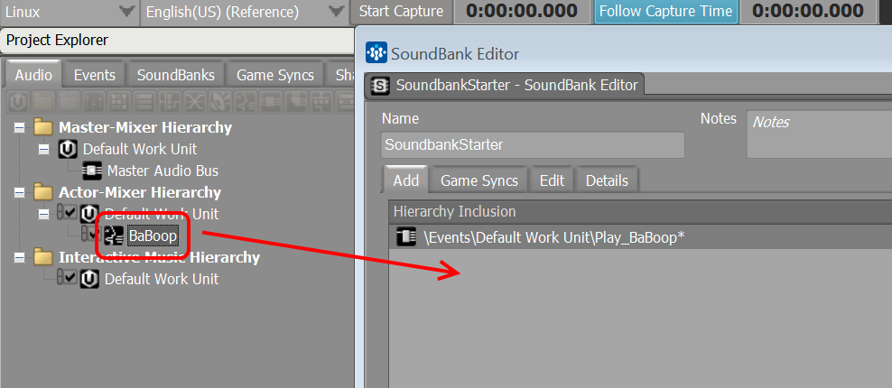
*Figure: Adding the audio file to the sound bank*

You should then see:

*Figure: The play event  and audio file in the sound bank*

### Generating the Soundbank

Now it is time to convert the files and generate the sound bank.

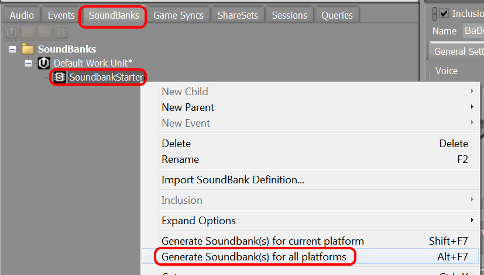
*Figure: Generate the sound bank*

1. Click on the SoundBanks tab.
2. Right click on our SoundBank.  This will pop up a menu
3. Choose "Generate SoundBank(s) for all platforms"

WWise will convert all of the audio files and create a sound bank.

## Packaging and Installations

### The folder with the files
Lets look at the generated files now.  Open the folder you created for your
WWise project.  It should look like:

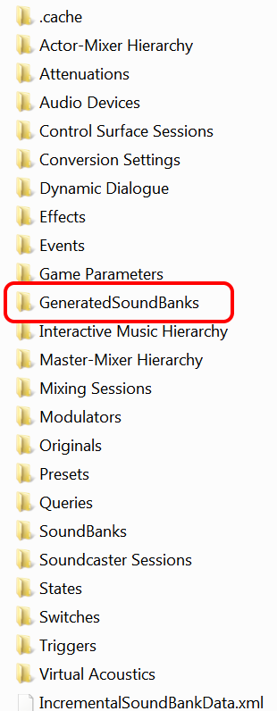
*Figure: The WWise project folder*

Open the "GeneratedSoundBanks" folder; inside of that open the "Linux" folder.
You should see a folder like:

*Figure: The soundbanks folder*

(The numbers and names will be different.)

Make a note of the ".txt" file with the soundbank name.  We will need that later.

### Making a package

We need to get the .wem files and out .bnk file (ignore the Init.bnk) onto
Vector and placed in the following folder:

    /anki/data/assets/cozmo_resources/sound/

One way to do this is to make a `vpkg`.  The `.ini` for the package file might
look something like:

    [META]
    name=SoundbankStarter
    rel_num=1
    restart_type=maintenance-restart

    [files]
    /anki/data/assets/cozmo_resources/sound/SoundbankStarter.bnk=SoundbankStarter.bnk
    /anki/data/assets/cozmo_resources/sound/SoundbankStarter.txt=SoundbankStarter.txt
    /anki/data/assets/cozmo_resources/sound/822718018.wem=822718018.wem

    [permissions]
    /anki/data/assets/cozmo_resources/assets/cozmo_resources/sound=anki:anki 0444

Then create a vpkg, in this example called "SoundbankStarter":

    vector-pkg.py install --pkg=SoundbankStarter.vpkg

You will then copy the file on the bot and then install it with a command line like

    vector-pkg.py install --pkg=SoundbankStarter.vpkg

You will also need to edit a file so that Vector's audio engine knows to load it.
This file is

    /anki/data/assets/cozmo_resources/sound/SoundbankBundleInfo.json

By default in 1.7 it looks like:

    [{"bundle_name": "Victor_Global_Data_English(US)", "language": "English(US)", "path": "English(US)/Victor_Global_Data.bnk", "soundbank_name": "Victor_Global_Data"}, {"bundle_name": "Init", "language": "SFX", "path": "Init.bnk", "soundbank_name": "Init"}, {"bundle_name": "Victor_UI", "language": "SFX", "path": "Victor_UI.bnk", "soundbank_name": "Victor_UI"}, {"bundle_name": "Victor_VO", "language": "SFX", "path": "Victor_VO.bnk", "soundbank_name": "Victor_VO"}, {"bundle_name": "Victor_Alexa", "language": "SFX", "path": "Victor_Alexa.bnk", "soundbank_name": "Victor_Alexa"}, {"bundle_name": "Victor_SFX", "language": "SFX", "path": "Victor_SFX.bnk", "soundbank_name": "Victor_SFX"}, {"bundle_name": "Victor_Dev_English(US)", "language": "English(US)", "path": "English(US)/Victor_Dev.bnk", "soundbank_name": "Victor_Dev"}]

(Yes, this one long run-on line.)

We want to add a like that it, like so:

    [{"bundle_name": "Victor_Global_Data_English(US)", "language": "English(US)", "path": "English(US)/Victor_Global_Data.bnk", "soundbank_name": "Victor_Global_Data"}, {"bundle_name": "Init", "language": "SFX", "path": "Init.bnk", "soundbank_name": "Init"}, {"bundle_name": "Victor_UI", "language": "SFX", "path": "Victor_UI.bnk", "soundbank_name": "Victor_UI"}, {"bundle_name": "Victor_VO", "language": "SFX", "path": "Victor_VO.bnk", "soundbank_name": "Victor_VO"}, {"bundle_name": "Victor_Alexa", "language": "SFX", "path": "Victor_Alexa.bnk", "soundbank_name": "Victor_Alexa"}, {"bundle_name": "Victor_SFX", "language": "SFX", "path": "Victor_SFX.bnk", "soundbank_name": "Victor_SFX"}, {"bundle_name": "Victor_Dev_English(US)", "language": "English(US)", "path": "English(US)/Victor_Dev.bnk", "soundbank_name": "Victor_Dev"}
    ,{"bundle_name": "SoundbankStarter(US)", "language": "English(US)", "path": "SoundbankStarter.bnk", "soundbank_name": "SoundbankStarter"}
    ]

Next, restart the Vector application by:

    systemctl stop anki-robot.target
    sleep 5
    systemctl start anki-robot.target

Then we need to check the logs that the file loaded:

    grep SoundBank /var/log/messages

This shouldn't show a problem.  If you see something like the following, there was a problem.

    12-09 04:40:43.725 warning vic-anim 2103 2103 vic-anim: AudioEngineController.LoadSoundbank: Failed to load soundbank 'SoundbankStarter'

(The name of the soundbank being your soundbank.)  
(Check that the time stamp is about "now" -- just so that we aren't confused with old errors)

## Testing
When you wish to play the animation, lets open the text file we saw earlier.
In the example case it was called "SoundbankStarter.txt".  This file has the
info we need to play the sound.

*Figure: The soundbank event ids*

The number is the event id to be used inside of animations.
The name can be used in some JSON files; but it is als helpful when working
with multiple sounds in the file, to know which one is the right event.

The sound file can be tested using the console vars.  Please see 
[Development Web Servers](https://oskr.ddl.io/doc/tools.html#development-web-servers)
for how to set up access to these.

Go to 
    http://localhost:8889/

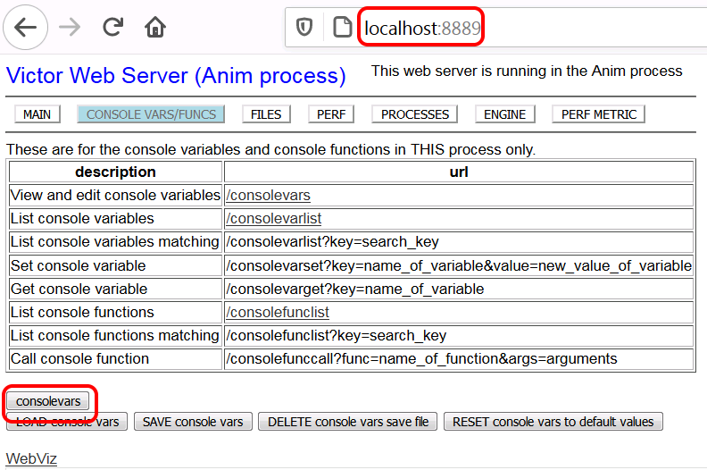
*Figure: Console vars button*

Click on the "consolevars".
This will bring up a pannel of tabs.  Click on the "Audio" tab:

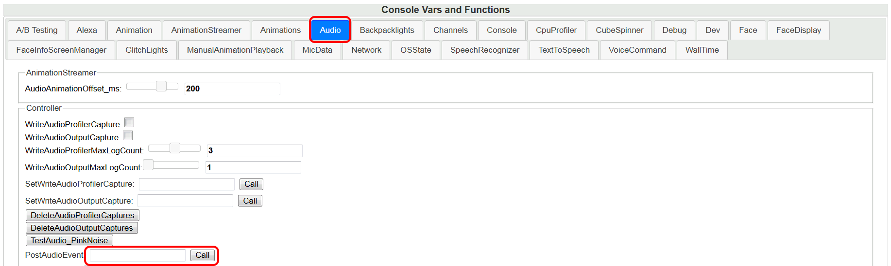
*Figure: Audio Console vars*

In the "PostAudioEvent" you can paste the Event Name (from your txt
above).  Then click "Call"  This should cause your new sound to play.
The Event ID will not work here.

## Future improvements

It would be nice to be able to bundle the soundbank and files into a folder, so
that it was clear which files belonged to which soundbank.

It's probably possible to script up the generation of the project files, and
then just open in WWise command line to do the final steps...
