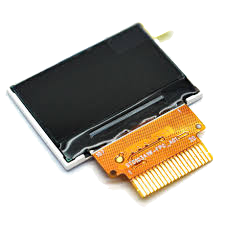

# LCD Replacement

A batch of Vectors have LCD screens that form lines on them.
The lines often start at the bottom, both marring the eyes and making
the Bluetooth LE pairing pin codes illegible.

The community initially thought that the LCD connections to the head-board
became delaminate with falls, lots of head motion, shaking and bad luck.
This was wrong.

It was a bad batch of LCDs with a fauly gasket on the glass/plastic pieces
that let humidity in and corrodes the electrical bits.

Project Victor has done some work to locate a replacement LCD
LCD replacement

* ST0103A3W from http://www.santechnology.com/products/

[terminator3d3700](https://www.reddit.com/user/terminator3d3700/) has been
working on a home set up to replace LCD displays, with some success:

* See https://www.reddit.com/r/AnkiVector/comments/jwu77d/vector_displays/
* https://www.reddit.com/r/AnkiVector/comments/ju7i4i/vectors_new_screen/
* Contact him if interested

