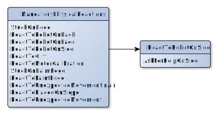

*Figure: The mandatory physical reactions behavior tree*

The *MandatoryPhysicalReactions* is used to react when Vector is:

* On his side, face, or back
* Encounters a cliff
* Is stuck on cliff edge
* Needs to calibrate the head or lift motors
* Some interaction with being held in the palm of a hand
* Is falling or is being picked up
* Is on a slope
* Is being moved around

The behavior file is located at:

    behaviors/victorBehaviorTree/reactions/mandatoryPhysicalReactions.json
    
For the most part, the *MandatoryPhysicalReactions* provides a way to
prioritize the internal C++ implementation; most of these behavior references
do not link to other behaviors or animations.

The only one of interest is *ReactToRobotOnSide* which initiates
*AskForHelpOnSide* behavior to call for someone to come and help.

* *ReactToCliff* has configuration for how fast and far Vector backs up in
  responds to a a cliff.
* *ReactToUnexpectedMovement* has configuration for how fast and far Vector
  backs up when he experiences being moved by someone; as well as how much
  he can respond.

## Change history synopsis

|Date|Change|
|----|------|
|2020-12-1|Created|

