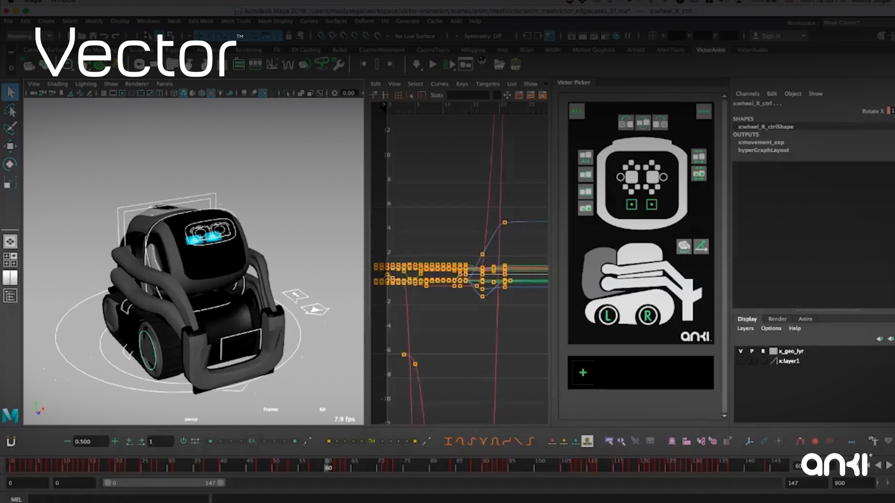
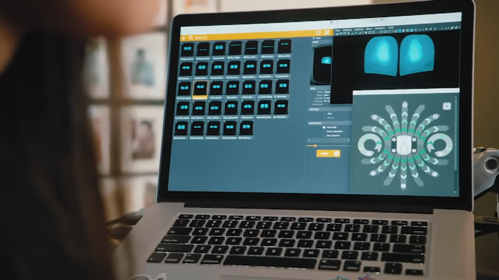
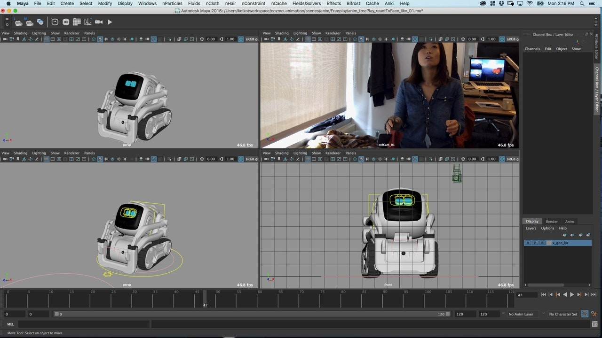

# Animation tool

## Maya
Anki used Maya to animate Cozmo and Vector.
The tool used a plugin to emit the movements, as JSON using a format
that the animation engine could read with the flatbuffers library.
(See *[How to convert animation bin files to JSON](../how-to/How to convert animation bin files to JSON.md)* for a bit more on converting between JSON text and the binary format.)

The animations tools had UIs with at least the following two screens:

### More Info
* [Maya Tutorial (Beginner Video 2016)](https://youtu.be/tElsku3aKQI)
* [AutoDesk Maya Tutorial Links](https://knowledge.autodesk.com/support/maya/learn-explore/caas/simplecontent/content/maya-tutorials.html)
