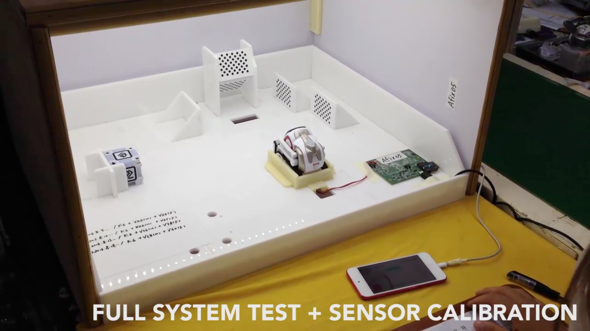
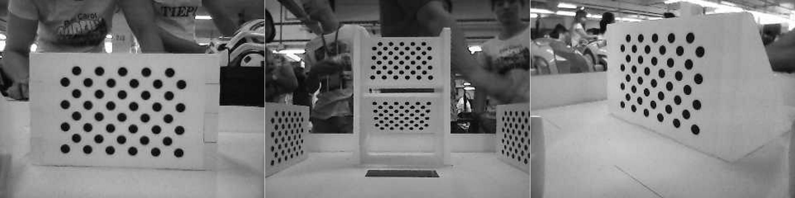

# Playpen

Playpen is a test station used calibration Vector and Cozmo's camera, and
perhaps other sensors.

>Once Cozmo is fully assembled, he's placed in the Playpen to take his "final test".
He does a lot of things in there, but one thing he does is an eye test. He drives around from target to target, making sure he can count all the dots, they're all in focus, and they're all where he expects them to be (literally, his head is on straight!).[discord][0]

## Cozmo's playpen

This is what one looks like for Cozmo:

And for Vector

And this is what Cozmo sees:

A direct shot of a calibration image that Vector sees:

## Creating a new one for Vector?

TODO / TBD:  We don't know how to make a replacement one yet.
Or all the steps in issuing commands to Vector.

[0]: https://discord.com/channels/527874754342944770/527879536269066241/691299483878686762

