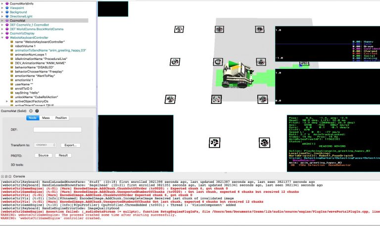

# Webots

Anki used Webots to test Cozmo and Vector's emotion model  on the
desktop before downloading.
And perhaps the behavior tree.

>Cozmo’s Mood Manager can be visualized in Webots, a software program designed for the development and simulation of robots. Labeled by the small, multi-color words (top right-hand corner of the photo), data points change over time based on Cozmo’s mood.([Interview with Sr Sound Designer Ben Gabaldon][0])

[0]: https://designingsound.org/2016/11/15/sound-for-robots-an-interview-with-sr-sound-designer-ben-gabaldon/

