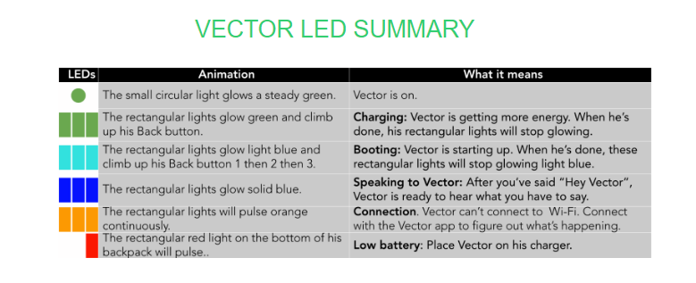

# Backpack Lights

Things that this could do:

* Diagram of the backpack lights
* Show the FAC lights
* Changes to the backpack lights in the custom software

See also DDL.

# Purple circle light

* For the first few seconds at boot, this is normal and should get fixed later on in the body board boot process. However, if your Vector is stuck on it and he shows an error code (801, 898, 899), there could be an issue. First try to reboot by holding the button for 5-6 seconds. If that doesn't work, leave him and let the battery die. This will probably take a few hours. After the battery dies, turn him back on. If he still shows a purple light after being turned back on, then there is a hardware issue on the bodyboard. 
