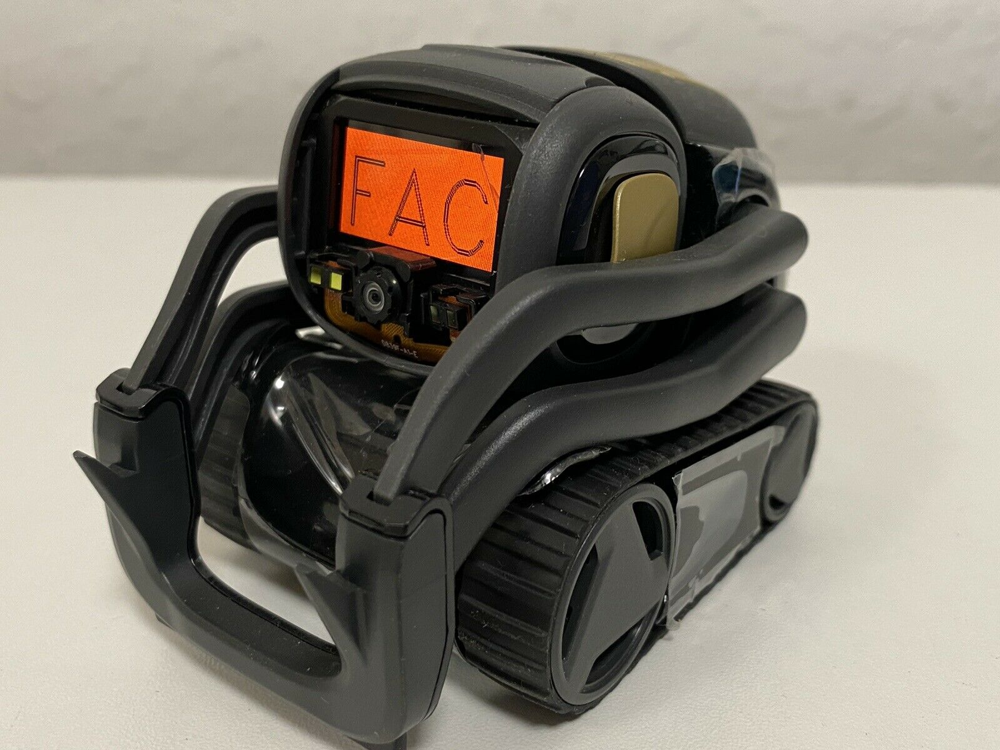
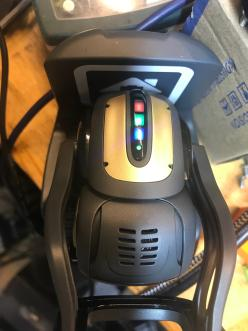

# FAC (Factory) Mode

Vector has a "FAC" mode, used in the factory to test and calibrate the robot.
When in FAC mode, the display has a red background, with either the letters "FAC" displayed:

Or one to two digits displayed (these are likely the testing stage to be performed),

And his backpack lights have an unusual color pattern – red, green, and blue:

This mode is never intended to be seen outside of the factory, so little is
known.  Only a couple of units have been found in this mode; one after it had
been intentionally damaged, and its calibration & EMR data were corrupted or
inaccessible.   In all likelihood, the software checks its EMR to see if it
has been released; if not, it enters the FAC mode at whatever the "next" stage
is according to the EMR.  At that point Vector expects to be placed into
manufacturing test fixtures, such as the playpen.
